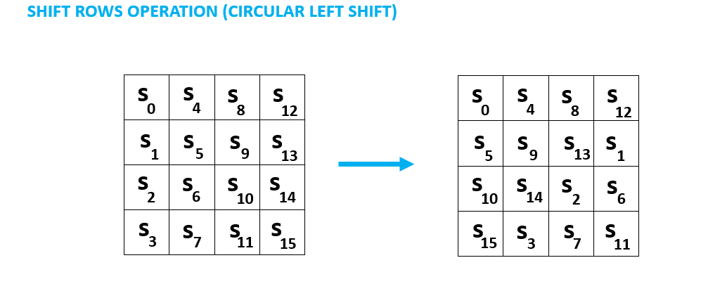

# Advance Encryption Standard (AES)

## Overview
DES is no longer secure: key size is too short.

AES: private key with three different key lengths: **128**, **192** and **256** bits

Plain text block of **128** bits.

Key size: **128** bits

Cipher text block of **128** bits

We represent the data (plain text, cipher text, key) as matrices

## Workflow

Add round key operation = XOR: Use bitwise XOR operation on a bit-by-bit basis

S-BOX: 8-bit -> S-BOX -> 8-bit

Example: 0x58 = 0b(01011000) -> 0101 is row index, 1000 is column index -> convert to 0x6a

Shift rows operation (circular left shift)

Mix column operation

This step is matrix vector multiplication

s'0 = (2 . s0) XOR (3 . s1) XOR (1 . s2) XOR (1 . s3)

s'1 = (1 . s0) XOR (2 . s1) XOR (3 . s2) XOR (1 . s3)

s'2 = (1 . s0) XOR (1 . s1) XOR (2 . s2) XOR (3 . s3)

s'3 = (3 . s0) XOR (1 . s1) XOR (1 . s2) XOR (2 . s3)

'.' is vector multiplication, which can be translated as below:
- Multiply by 1: same value
- Multiply by 2: left shift by 1 bit, then XOR with 0x1b if the original byte >= 0x80
- Multiply by 3: (2 . x) XOR x

