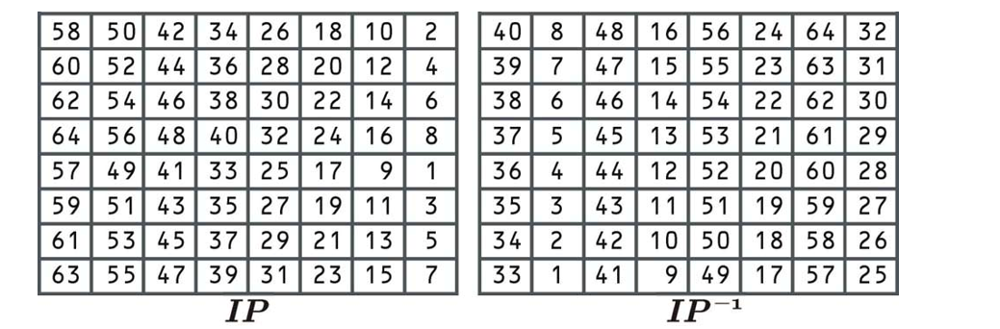

# Data Encryption Standard (DES)

## Overview
- Symmetric-key algorithm
- Block cipher: The plain text is processed to the cipher text in number of blocks
- Hybrid of sustitution (thay thế) and permutation (hoán vị)

## Details
1. Split the plain text into **64 bits of blocks**. These blocks are the input for the **16 rounds**
2. Each round contains substitutions, XOR operations etc. 
3. Every round needs a different key (called *sub-key*). The key is generated from the original **64 bits** private key, and **48 bits long**

## Workflow

The order of the bits in initial permutation and its inverse:

Round functions:

Expansion functions: In this phase the DES algorithm transforms a **32 bits** input into a **48 bits** output: **16 extra bits** will be added: the bits on the left column and the bits on the right column

Permuted choice 1 (PC-1): The **64 bits** long private key is splitted into two **32 bits**. Then some bits are omiited (8, 16, 24, 32, 40, 48, 56 and 64) to keep only two **28-bits** left/right key

Permuted choice 2 (PC-2): Select 48 bits from 56 bits after circular left shift

S-boxes: There are 8 s-boxes in the DES algorithm, those are substitution boxes - Input is 6 bits -> Output is 4 bits

Consider the following number: 0 1 1 0 1 1

The LSB and MSB defines the row index in the s-box: 01

The middle 4 bits defines the column index in the s-box: 1101

Final permutation: 32 bits to 32 bits after using s-box

## Decryption
Use the same function we have used with encryption with the subkeys in a reverse order 

Encryption: we start with the first subkey then second ...

Decryption: we start with the last (16-th) subkey ...

