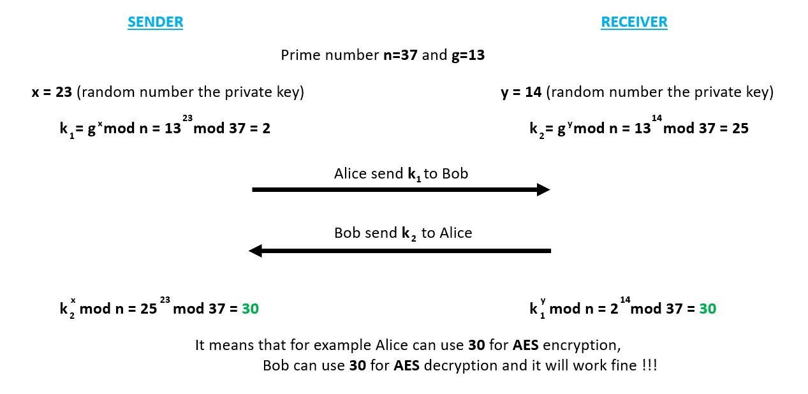

# Diffie-Hellman key exchange

The main disadvantage of private key cryptosystems is that the private key must be exchanged.

Diffie-Hellman algorithm is able to **exchange private keys** over a public channel. This approach is *not for encryption or decryption* but to securely *exchange the private keys* for symmetric cryptosystems.

## Step 1:

The sender (*Alice*) generates huge prime numbers **n** and **g**, which **g** must be the primitive root of **n**, and sends it to the receiver (*Bob*)

**Primitive root**: **g** is the primitive root of **n** if (g mod n), (g^2 mod n), ... (g^(n-1) mod n) generates all the integers from [1, n-1]

## Step 2:

Both the sender and the receiver generate a **random number < n-1**. Alice generates *x* and Bob generates *y*. 

## Step 3:
Alice calculates k1 = (g^x mod n) and sends it to Bob, while Bob calculate k2 = (g^y mod n) and sends it to Alice. 

## Step 4:
Calculate the shared secret key:
Alice calculates:   (k2)^x mod n = (g^y mod n)^x mod n = g^(xy) mod n
Bob calculates:     (k1)^y mod n = (g^x mod n)^y mod n = g^(xy) mod n
Both will receive the same value which can be used for private key in symmetric cryptosystem

